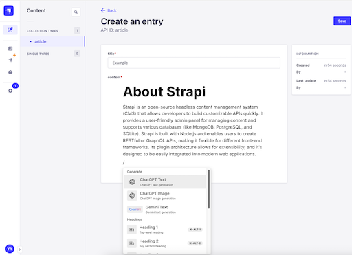
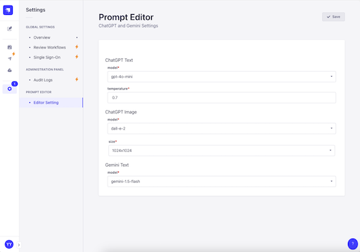
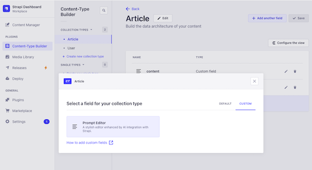
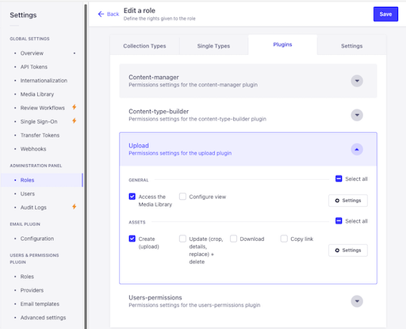
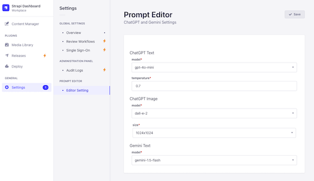

# strapi-plugin-prompt-editor

Stylish editor that works with ChatGPT and Gemini

# Demo
<video src="docs/demo.mp4" controls="true"></video>





# Setup

### install

```
npm i strapi-plugin-prompt-editor
```

### edit config

```
# config/plugins.js
...
 'prompt-editor': {
    enabled: true,
    config: {
      openai_api_key: process.env.OPENAI_API_KEY,
      gemini_api_key: process.env.GEMINI_API_KEY
    }
  },
...
```

### add Custom Field



# required role permission

To generate images or upload them to a folder other than the root folder, the following permissions are required.

- Access the Media Library
- Create (upload)



# Setting the admin panel

You can change the default settings for model and image size.



# Change the model you can select

Selectable models can be changed from config.
```
// example
'prompt-editor': {
  enabled: true,
  config: {
    openai_api_key: process.env.OPENAI_API_KEY,
    gemini_api_key: process.env.GEMINI_API_KEY,
    chatGPTTextModels: [
      'gpt-4o',
      'gpt-4o-mini',
      'gpt-4',
      'gpt-3.5-turbo'
    ],
    chatGPTImageModels: [
      {
        name: 'dall-e-2',
        size: [
          '256x256',
          '512x512',
          '1024x1024'
        ]
      },
      {
        name: 'dall-e-3',
        size: [
          '1024x1024',
          '1792x1024',
          '1024x1792'
        ]
      }
    ],
    geminiTextModels: [
      'gemini-1.5-flash',
      'gemini-1.5-pro',
      'gemini-1.0-pro',
    ]
  }
}
```
